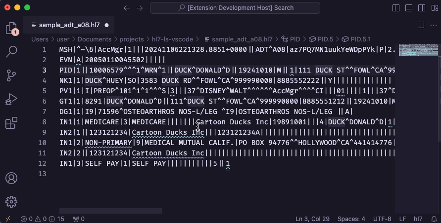

# HL7 Language Server for Visual Studio Code

This is a plugin for Visual Studio Code that provides language server support
for HL7 messages. It uses the [hl7-ls](https://github.com/hamaluik/hl7-ls)
language server to parse HL7 messages and provides several core LSP features
for HL7 messages.



## Installation

### Prerequisites

This plugin requires that you have the `hl7-ls` language server installed. You
can install it by following the instructions in the
[hl7-ls](https://github.com/hamaluik/hl7-ls) repository.

### Configuration

The path to the `hl7-ls` executable must be set in the `hl7-ls.executablepath`
setting. This can be done in the user settings or workspace settings. For
example:

```json
{
    "hl7-ls.executablepath": "/path/to/hl7-ls"
}
```

## Usage

This plugin creates the `hl7` filetype, and will automatically start the
language server when you open a file with the `hl7` filetype. The language
server will parse the HL7 message and provide diagnostics, hover information,
completion suggestions, and more.

## TODO

- [ ] Add support for the send message command

## Debugging Locally

- Run `npm install` in this folder. This installs all necessary npm modules in
both the client and server folder
- Open VS Code on this folder.
- Press Ctrl+Shift+B to start compiling the client and server in [watch
mode](https://code.visualstudio.com/docs/editor/tasks#:~:text=The%20first%20entry%20executes,the%20HelloWorld.js%20file.).
- Switch to the Run and Debug View in the Sidebar (Ctrl+Shift+D).
- Select `Launch Client` from the drop down (if it is not already).
- Press ▷ to run the launch config (F5).
- In the [Extension Development
Host](https://code.visualstudio.com/api/get-started/your-first-extension#:~:text=Then%2C%20inside%20the%20editor%2C%20press%20F5.%20This%20will%20compile%20and%20run%20the%20extension%20in%20a%20new%20Extension%20Development%20Host%20window.)
instance of VSCode, open a document in 'hl7' language mode.
